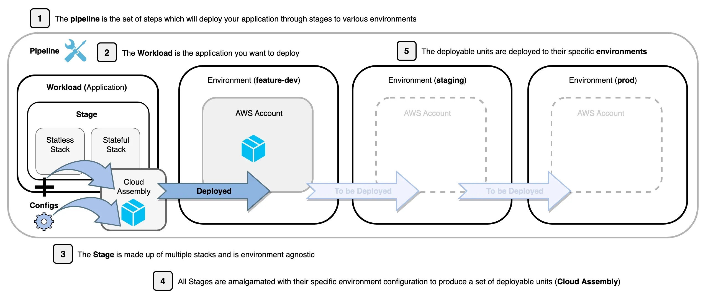
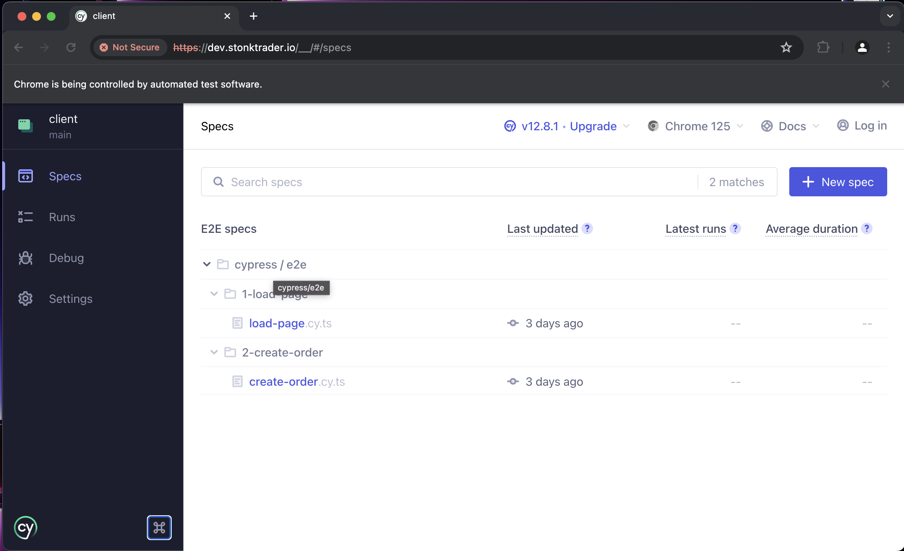
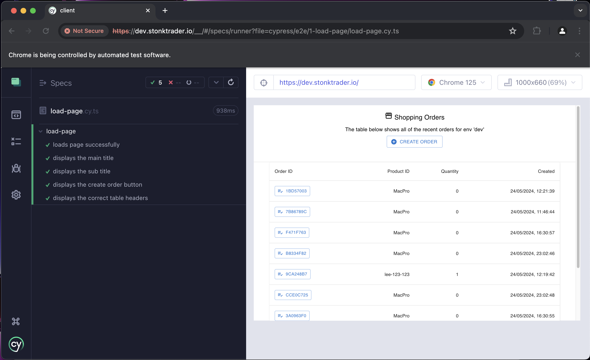
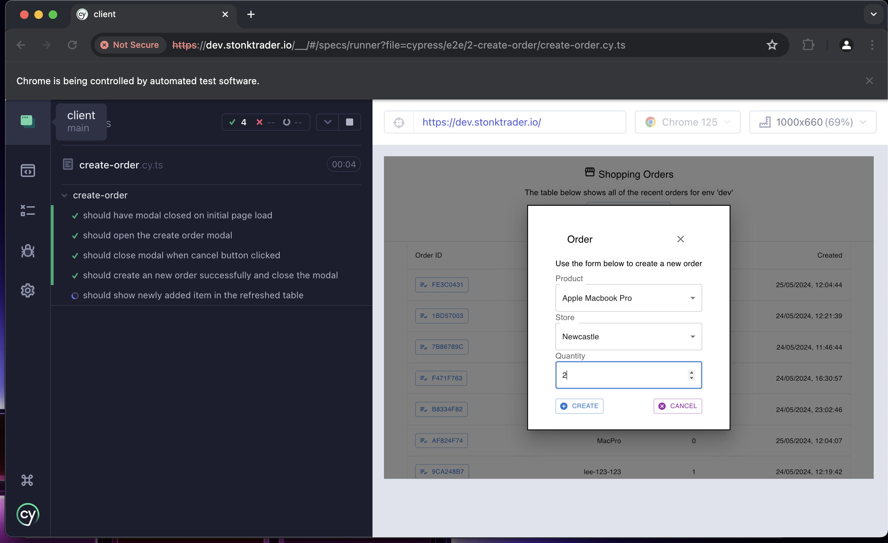
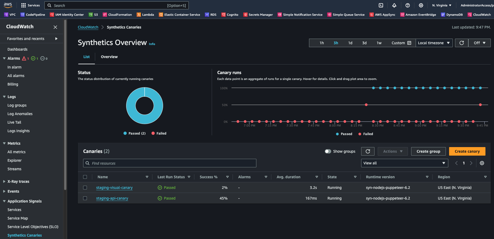

# Serverless AWS CDK Pipeline Best Practices and Patterns

Notes and example code for this article: https://blog.serverlessadvocate.com/serverless-aws-cdk-pipeline-best-practices-patterns-part-1-ab80962f109d

## Preface

- We should create different stacks per environment within the CDK app
- We should split stateful (DB/S3) and stateless (lambda) resources into separate stacks
- We should allow for different configurations per stack, without the use of environment variables (aside from ephemeral envs)
- We should synthesize the assets once, allowing for a deterministic immutable build to be deployed through all environments

# Part 1 - Setting up the Pipeline

This information is taken from

- [Deployment Pipeline Reference Architecture](https://pipelines.devops.aws.dev/)
- [Best practices for developing cloud applications with AWS CDK](https://docs.aws.amazon.com/cdk/v2/guide/best-practices.html#best-practices-apps)
- [The CDK Handbook](https://thecdkbook.com/)

## Example Application

1. Customers use API Gateway to create and retrieve an order
2. The "get order" lambda retruns an order by ID
3. The "create order" lambda creates the order and returns the order ID
4. The order data is stored in DynamoDB
5. An invoice is stored in S3

## Common Vocabulary

- **Workloads** - A workload is a set of components that together deliver business value (_essentially a service or application_). A workload is usually the level of detail that business and technology leaders communicate about. Examples of workloads are marketing websites, e-commerce websites, the back-end of a moble app, analytic platforms, etc.
- **Environment** - An environment is an isolated target for deployment and testing of a workload and its dependencies. Essentially its Region + Account.
- **Cloud Assembly** - This is the output of the synthesis (_build_) operation. It is essentially a set of files including CloudFormation and the `manifest.json` file that defines the set of instructions needed to deploy the assembly.
- **Stage** - An '_abstract application modelling unit_' consisting of one or more stacks that should be deployed together. You can create multiple instances of a stage to model multiple copies of the application which are deployed to different environments _with their own configuration_ as shown below:



## Key considerations and code walkthrough

### All environment specific stacks (stages) in code

One of the key differences between AWS CDK and CloudFormation is that AWS CDK should contain each stage/environment with its own configuration in the CDK app, instead of creating a single artifact that can be parameterized.

> In traditional AWS CloudFormation scenarios, your goal is to produce a single artifact that is parameterized so that it can be deployed to various target environments after applying configuration values specific to those environments. In the CDK, you can, and should, build that configuration into your source code. Create a stack for your production environment, and create a separate stack for each of your other stages.

> When you synthesize your application, the cloud assembly created in the cdk.out folder contains a separate template for each environment. Your entire build is deterministic. There are no out-of-band changes to your application, and any given commit always yields the exact same AWS CloudFormation template and accompanying assets. This makes unit testing much more reliable. — [https://docs.aws.amazon.com/cdk/v2/guide/best-practices.html](https://docs.aws.amazon.com/cdk/v2/guide/best-practices.html)

#### Key Outcome

- Create different stages and therefore stacks for each specific environment i.e. ProdStack, FeatureDevStack, StagingStack etc.

#### Disadvantages

- Although this is best practice, you may find that there is an overhead in the initial creation of the multiple stacks

---

### Configurations should be in code, not using environment variables

Within your CDK apps, you should add your configuration as actual code as opposed to passing through environment variables. This is discussed in the best practices paper also:

> Put the configuration values for each stack in the code. Use services like Secrets Manager and Systems Manager Parameter Store for sensitive values that you don't want to check in to source control, using the names or ARNs of those resources.

> Environment variable lookups inside constructs and stacks are a common anti-pattern. Both constructs and stacks should accept a properties object to allow for full configurability completely in code. Doing otherwise introduces a dependency on the machine that the code will run on, which creates yet more configuration information that you have to track and manage.

> In general, environment variable lookups should be limited to the top level of an AWS CDK app. They should also be used to pass in information that’s needed for running in a development environment

Looking through `pipeline-config.ts` we can see that there's a `feature` stage that does use environment variables, as this is specifically for developers to create their own ephemeral environments.

For develop/staging/production, we have specific configurations for each, which are synthesized into the cloud assembly once as an immutable build.

#### Key Outcome

- As each of our environments (_stages_) may need a differing configuration, we should create an object to pas through as props to the given stack. As discussed, the use of environement variables within stacks is a known anti-pattern. Also, the configuration can be tested using Jest snapshots, as it is deterministic at build time.

#### Disadvantages

- None - Using environment variables is no more or less onerous than using configuration as code; as well as environment variables being an anti-pattern.

---

### Stateless vs Stateful Stacks

When we build our AWS CDK applications, we should ideally split each environment between stateless and stateful stacks.

> Consider keeping stateful resources (like databases) in a separate stack from stateless resources. You can then turn on termination protection on the stateful stack. This way, you can freely destroy or create multiple copies of the stateless stack without risk of data loss.

> Stateful resources are more sensitive to construct renaming — renaming leads to resource replacement. Therefore, don’t nest stateful resources inside constructs that are likely to be moved around or renamed (unless the state can be rebuilt if lost, like a cache). This is another good reason to put stateful resources in their own stack. - [https://docs.aws.amazon.com/cdk/v2/guide/best-practices.html](https://docs.aws.amazon.com/cdk/v2/guide/best-practices.html)

#### Key Outcome

- Although this means for each stage we have two stacks, it does make sense to split your stacks from both a security perspective, as well as keeping code that changes often away from code that rarely changes. This allows developers to concentrate mainly on one area of the code base, and reduce cognitive load.

#### Disadvantages

- The only disadvantage here is that you initially create two stacks per environment over one which could be argued is more work; however the benefits for developers after this far outweigh this.

---

### Shared Constructs

Shared constructs should be used within your organisation to reduce duplication of effort, make your solutions more secure, and reduce cognitive load on teams.

1. We want to reduce the cognitive load on development teams, and we can easily wrap complex patterns and reference architecture into composable units.
2. They should be deployed as a versioned code artefact to a shared repository
3. Key areas of the business, such as AppSec, can influence the L3/L4 constructs; as well as embedding dashboards for SREs, for example.

> When packages begin to be used in multiple applications, move them to their own repository. This way, the packages can be referenced by application build systems that use them, and they can also be updated on cadences independent of the application lifecycles. However, at first it might make sense to put all shared constructs in one repository.

#### Key Outcome

- Shared constructs should be used within your organization to reduce duplication of effort, make solutions more secure, and reduce cognitive load on teams. They should be versioned and deployed to a shared library/repository

#### Disadvantages

- None - No reason to duplicate code across an organization. The only overheads are versioning and publishing

---

### Build one set of deterministic assets

Once we have split our app into multiple stacks for each environment, we need to consider how we build and deploy the correct version to each environment. CDK Pipelines manages this for us under the hood.

> When you synthesize your application, the cloud assembly created in the cdk.out folder contains a separate template for each environment. Your entire build is deterministic. There are no out-of-band changes to your application, and any given commit always yields the exact same AWS CloudFormation template and accompanying assets. This makes unit testing much more reliable.

We can achieve this when we have our stages modelled as separate stacks, as when we perform a cdk synth we are essentially building one set of immutable deterministic assets (cloud assembly) for all environments.

> The source code should only be built and packaged once. The packaged artifact should then be staged in a registry with appropriate metadata and ready for deployment to any environment. Build artifacts only once and then promote them through the pipeline. The output of the pipeline should be versioned and able to be traced back to the source it was built from and from the business requirements that defined it. - https://pipelines.devops.aws.dev/

- We use pipeline-stack.ts to create all of our stages in code. We add dev, stage, and prod to the pipeline, but not the feature stage

Under the hood, CDK pipeline is doing the following for us:

```
# Synthesize all templates once to the cdk.out as one build
cdk synth

# Deploy our feature-dev stage and reference the assembly folder
cdk deploy --app 'cdk.out/' Development

# Do some tests here and approve stage

# Deploy our staging stage
cdk deploy --app 'cdk.out/' Staging

# Do some tests here and approve stage

# Deploy our prod stage (potentially after a manual approval step)
cdk deploy --app 'cdk.out/' Prod
```

**Note**: Under the hood the CDK Pipeline is performing a 'cdk deploy'
for each of the stages using the --app parameter which allows you
to deploy specific stacks within the 'cdk.out' folder i.e. although
cdk synth is building all environments, we can specifically deploy
one environment at a time.

#### Key Outcome

- We can use the `cdk deploy` command with the `--app` flag to allow us to deploy a given environment with the cloud assembly that contains all of the environments (i.e. development, staging, prod) or we can allow the CDK Pipeline to manage it for us as part of the pipeline process

#### Disadvantages

- You could argue that it's easier to just perform a `cdk deploy` with the given stack names at each stage, as opposed to the initial synth and passing the immutable assets through the pipeline. IMO the benefits outweigh outweigh the extra initial setup, since the best practice is to produce one set of immutable assets at the start of the pipeline.

---

### AWS account per environment, per service

For this one, we will keep high level, but it is standard practice to have an AWS account per environment, per service.

> Best practice is for each environment to run in a separate AWS account. - [AWS Well-Architected Framework](https://docs.aws.amazon.com/wellarchitected/latest/framework/welcome.html)

This is therefore something we need to consider when deploying our stages, as the configuration values need to be passed through into the stage props as discussed earlier (allowing us to deploy to different accounts):

```
export const enum Region {
  virginia = "us-east-1",
  ohio = "us-east-2",
  california = "us-west-1",
}

export const enum Stage {
  feature = "feature",
  staging = "staging",
  prod = "prod",
  dev = "dev",
}

export const enum Account {
  feature = "11111111111",
  staging = "22222222222",
  prod = "33333333333",
  dev = "44444444444",
}
```

This allows us to use this static configuration when creating the stage specific application configuration to be passed into the pipeline as shown below:

```
const developmentStage: PipelineStage = new PipelineStage(
  this,
  "Development",
  {
    ...environments.dev,
  }
);
```

#### Key Outcome

- We should have a dedicated AWS account per environment for each of our services, which is considered a standard practice in the industry. We should pass in these account details as stage props when deploying to multiple accounts

#### Disadvantages

- None - Accounts are free, it's a best practice

---

### Ephemeral Environments

One of the key tenants of Serverless is that you pay for use, so it makes it easy and quick to deploy temporary ephemeral environments when needed; for example developer testing or within pipelines for e2e tests. How do we manage this if we have environment specific configuration which is static?

We can achieve this by only allowing the use of environment variables for ephemeral environments, whereby the stage can be deployed to an environment direct from the developers machine using dynamic values:

```
    // add the feature stage on its own without being in the pipeline
    // note: this is used purely for developer ephemeral environments
    new PipelineStage(this, `feature-${environments.feature.stageName}`, {
      ...environments.feature,
    });
```

Then, we can pull in the required environment variables at build time within the same `pipeline-config.ts` file as shown below

```
  // allow developers to spin up a quick branch for a given PR they are working on e.g. pr-124
  // this is done with an npm run dev, not through the pipeline, and uses the values in .env
  [Stage.feature]: {
    env: {
      account:
        process.env.ACCOUNT || (process.env.CDK_DEFAULT_ACCOUNT as string),
      region: process.env.REGION || (process.env.CDK_DEFAULT_REGION as string),
    },
    stateful: {
      bucketName:
        `serverless-stack-${process.env.PR_NUMBER}-bucket`.toLowerCase(),
    },
    stateless: {
      lambdaMemorySize: parseInt(process.env.LAMBDA_MEM_SIZE || "128"),
    },
    stageName: process.env.PR_NUMBER || Stage.feature,
  },
```

This pulls in values from a `.env` file

```
PR_NUMBER="PR-123"
LAMBDA_MEM_SIZE="128"
ACCOUNT="1111111111"
REGION="us-west-1"
```

The ephemeral environment can be deployed via the following npm script:

```
"deploy:feature": "cdk deploy ServerlessPro/FeatureIssue123/StatefulStack ServerlessPro/FeatureIssue123/StatefulStack"
```

**TODO:** We could look at a shell script to pull in the Feature label

#### Key Outcome

- We will always need the flexibility of creating one-off ephemeral environments for developers, and this allows us to do it dynamically outside of the pipeline

#### Disadvantages

- Developers need to remember to tear down their environments when they are done with them

---

### `cdk.context.json` used for dynamic lookups only

One of the outputs from a cdk synth is the CDK managedcdk.context.json file, which is described as:

> The CDK Toolkit uses context to cache values retrieved from your AWS account during synthesis. Values include the Availability Zones in your account or the Amazon Machine Image (AMI) IDs currently available for Amazon EC2 instances. Because these values are provided by your AWS account, they can change between runs of your CDK application. This makes them a potential source of unintended change. The CDK Toolkit’s caching behaviour “freezes” these values for your CDK app until you decide to accept the new values.

> The AWS CDK includes a mechanism called context providers to record a snapshot of non-deterministic values. This allows future synthesis operations to produce exactly the same template as they did when first deployed.

> The only changes in the new template are the changes that you made in your code. When you use a construct’s .fromLookup() method, the result of the call is cached in cdk.context.json. You should commit this to version control along with the rest of your code to make sure that future executions of your CDK app use the same value. - [https://docs.aws.amazon.com/cdk/v2/guide/best-practices.html#best-practices-apps](https://docs.aws.amazon.com/cdk/v2/guide/best-practices.html#best-practices-apps)

An example of when the cdk.context.json file is populated would be through the following code as this is essentially a lookup on values that _could_ change and **are not deterministic**:

```
const vpc = ec2.Vpc.fromLookup(this, 'VPC', {
  vpcId: 'vpc-id-111111111',
});
```

It would be easy to add all of our environment specific configuration options directly to the cdk.context.json file and read in the values at synth time; however, **the file is automatically generated and managed solely by the CDK**, so the best practice states:

> Cached context values are managed by the AWS CDK and its constructs, including constructs you may write. Do not add or change cached context values by manually editing files. It can be useful, however, to review cdk.context.json occasionally to see what values are being cached.

> Context values that don't represent cached values should be stored under the context key of cdk.json. This way, they won't be cleared when cached values are cleared. - [https://docs.aws.amazon.com/cdk/v2/guide/context.html](https://docs.aws.amazon.com/cdk/v2/guide/context.html)

Based on the above, we could potentially add environment specific context (config) values to the cdk.json file as they don’t represent cached values, and won’t be cleared down with the following command:

```
cdk context --clear
```

There is one big issue for me with using this option: IntelliSense. This is something that you won’t get with using the cdk.json file as you would need to use the following code, or similar, to get a value at synth time in code based on environment:

`app.node.tryGetContext('prod').bucketName`

When we have a large number of configuration properties this could lead to frustration and errors in our stack code, as opposed to having a typed object which can be used in code with Intellisense features.

Another benefit of this approach as discussed earlier is unit testing the configuration using Jest snapshots as shown below:

```
import { environments } from './pipeline-config';

// the config is deterministic so we can test this in our code
describe('pipeline-config', () => {
  it('should return the correct config for feature-dev', () => {
    expect(environments.featureDev).toMatchSnapshot();
  });

  it('should return the correct config for staging', () => {
    expect(environments.staging).toMatchSnapshot();
  });

  it('should return the correct config for prod', () => {
    expect(environments.prod).toMatchSnapshot();
  });
});
```

This is why personally I would go with the approach of the environment specific configuration being typed using TypeScript, which also makes for ease of testing and validation where required too.

#### Key Outcome

- Because they're part of the application state, `cdk.json` and `cdk.context.json` should be committed to source control along with the rest of the source code. Allow the CDK to manage dynamic values.

- We could potentially use the `cdk.json` file to hold our non-dynamic environment configuration values, but then we can't use Intellisense or type safety

#### Disadvantages

- One disadvantage could be having configuration values in two places, i.e. a typed object file as well as the `cdk.json` file. This would be one for coding standards and ways or working in your organisation I would say personally (_agree on one and stick to it!_)

---

---

# Part 2 - Pipeline Testing, Manual Approval, Database Deploys and SAST Tooling

## Example Application Updates

The example application created in part 1 will be updated to add the additional refinements:

1. Developers commit changes to the code and push to GitHub. At this build stage, we run unit testing, linting, formatting, and SAST on pre-commit

2. A webhook in GitHub invokes our CDK Pipeline with the exact commit information

3. The AWS CDK Pipeline is self-mutating, so any changes to pipeline code are deployed during a self-update process.

4. CodePipeline is invoked to run the actual pipeline now that it has been updated. This is across our 3 stages (Development, Staging, and Production). This is where we perform our tests

5. As part of this pipeline, a custom resource invokes a lambda function which seeds our configuration data to DynamoDB (store data configuration)

6. The pipeline performs integration tests using Postman and Newman, as well as load testing with Artillery.

## Key Considerations and Code Walkthrough

In part 2 we will be updating the application, focusing on Build, Test and Staging stages.

### Build Stage

#### Code Quality

> Run various automated static analysis tools that generate reports on code quality, coding standards, security, code coverage, and other aspects according to the team and/or organization’s best practices. AWS recommends that teams fail the build when important practices are violated (e.g., a security violation is discovered in the code). These checks usually run in seconds. Examples of tools to measure code quality include but are not limited to Amazon CodeGuru, SonarQube, black, and ESLint - [https://pipelines.devops.aws.dev/application-pipeline/index.html#build](https://pipelines.devops.aws.dev/application-pipeline/index.html#build)

In this example, we will use eslint, tslint and prettier to ensure that we have code quality standards and a style guide.

```sh
npm install --save-dev \
  prettier@2 \
  eslint@8 \
  @typescript-eslint/parser@5 \
  @typescript-eslint/eslint-plugin@5 \
  eslint-config-prettier@8 \
  eslint-plugin-prettier@4
```

Create ESLint config file `.eslintrc`

```json
{
  "parser": "@typescript-eslint/parser",
  "parserOptions": {
    "ecmaVersion": "latest",
    "sourceType": "module"
  },
  "extends": [
    "prettier",
    "eslint:recommended",
    "plugin:@typescript-eslint/recommended"
  ],
  "plugins": ["prettier", "@typescript-eslint"],
  "rules": {
    "prettier/prettier": ["error"],
    "@typescript-eslint/no-unused-vars": "error"
  }
}
```

Now we can add the following lint commands to the package.json scripts:

```json
{
  "lint": "eslint --ext .ts .",
  "lint:fix": "eslint --fix --ext .ts ."
}
```

Now, add the `.prettierrc.json` and `.prettierignore` files

```json
{
  "trailingComma": "es5",
  "semi": true,
  "singleQuote": true,
  "printWidth": 80,
  "tabWidth": 2,
  "bracketSpacing": true,
  "arrowParens": "always"
}
```

```
# Ignore artifacts:
build
coverage
cdk.out
tsconfig.json
```

#### Running the scripts automatically on pre-commit

We will use [Husky](https://www.npmjs.com/package/husky) to automatically run these scripts on pre-commit.

```
npm i --save-dev husky@8
```

Now we can add the commands to the package.json scripts

```json
{
  "prepare": "cd .. && husky install config/.husky",
  "precommit": "npm run synth && npm run test && npm run lint:fix && npm run format",
  "prepush": "npm run lint"
}
```

Now we can run `npm run prepare` to set up husky in the root of the project (inside of the `serverless-stack` application directory)

Then we can run the following (run from the project root)

```
npx husky add config/.husky/pre-commit "npm run precommit"

npx husky add config/.husky/pre-push "npm run prepush"
```

Now when you go to commit or push, the husky hooks will run and prevent you from sending code that does not meet standards

#### SAST - Static application security testing with cdk-nag

> Static application security testing (SAST) is a set of technologies designed to analyze application source code, byte code and binaries for coding and design conditions that are indicative of security vulnerabilities. SAST solutions analyze an application from the “inside out” in a nonrunning state. - [https://www.gartner.com/en/information-technology/glossary/static-application-security-testing-sast](https://www.gartner.com/en/information-technology/glossary/static-application-security-testing-sast)

We can use the `cdk-nag` npm package to accomplish this. The tool will validate our CDK code against a set of industry-recognized compliance NagPacks such as

1. [AWS Solutions](https://github.com/cdklabs/cdk-nag/blob/main/RULES.md#awssolutions)
2. [HIPAA Security](https://github.com/cdklabs/cdk-nag/blob/main/RULES.md#hipaa-security)
3. [NIST 800-53 rev 4](https://github.com/cdklabs/cdk-nag/blob/main/RULES.md#nist-800-53-rev-4)
4. [NIST 800-53 rev 5](https://github.com/cdklabs/cdk-nag/blob/main/RULES.md#nist-800-53-rev-5)
5. [PCI DSS 3.2.1](https://github.com/cdklabs/cdk-nag/blob/main/RULES.md#pci-dss-321)

> Infrastructure as Code (IaC) is an important part of Cloud Applications. Developers rely on various Static Application Security Testing (SAST) tools to identify security/compliance issues and mitigate these issues early on, before releasing their applications to production. Additionally, SAST tools often provide reporting mechanisms that can help developers verify compliance during security reviews. - [https://aws.amazon.com/blogs/devops/manage-application-security-and-compliance-with-the-aws-cloud-development-kit-and-cdk-nag/](https://aws.amazon.com/blogs/devops/manage-application-security-and-compliance-with-the-aws-cloud-development-kit-and-cdk-nag/)

We can implement this in our application by installing the package using `npm i cdk-nag` and then adding the following code to the `stateful-stack.ts` and `stateless-stack.ts`:

```
import { Aspects } from 'aws-cdk-lib';
import { AwsSolutionsChecks } from 'cdk-nag';
import { NagSuppressions } from 'cdk-nag';

Aspects.of(this).add(new AwsSolutionsChecks({ verbose: false }));
```

If certain nag rules are triggered, they can be suppressed by adding `NagSuppression` entries such as:

```js
NagSuppressions.addResourceSuppressions(this.bucket, [
  {
    id: "AwsSolutions-S1",
    reason: `Rule suppression for 'The S3 Bucket has server access logs disabled'`,
  },
]);
NagSuppressions.addResourceSuppressions(this.table, [
  {
    id: "AwsSolutions-DDB3",
    reason: `Rule suppression for 'The DynamoDB table does not have Point-in-time Recovery enabled'`,
  },
]);
```

---

### Test Stage

#### Database Deploy

> Apply changes to the beta database using the Database Source Code. Changes should be made in a manner that ensures rollback safety. Best practice is to connect to the beta database through cross-account IAM roles and IAM database authentication for RDS rather than long lived database credentials. If database credentials must be used, then they should be loaded from a secret manager such as AWS Secrets Manager. Changes to the database should be incremental, only applying the changes since the prior deployment. Examples of tools that apply incremental database changes include but are not limited to Liquibase, VS Database Project, and Flyway. - [https://pipelines.devops.aws.dev/application-pipeline/index.html#build](https://pipelines.devops.aws.dev/application-pipeline/index.html#build)

Common Scenarios:

1. Deploying Database Changes (e.g. new indexes, schema changes, populating data)
2. Deploying test data to non-production environments for testing
3. Deploying the base database configuration for the application

We are going to look at the latter for adding some basic database configuration for our ‘store’ data config, and we are going to utilise Custom Resources to deploy into our environment which is detailed fully in the following article:

**[Serverless Custom Resources](https://blog.serverlessadvocate.com/serverless-custom-resources-91c0aea2641a?source=post_page-----5446a417d232--------------------------------)**

We add our custom resources to the stateless-stack.ts file as shown below which runs for all stages:

```ts
const provider: cr.Provider = new cr.Provider(
  this,
  "PopulateTableConfigCustomResource",
  {
    onEventHandler: populateOrdersHandler, // this lambda will be called on cfn deploy
    logRetention: logs.RetentionDays.ONE_DAY,
    providerFunctionName: `populate-orders-${props.stageName}-cr-lambda`,
  }
);

// use the custom resource provider
new CustomResource(this, "DbTableConfigCustomResource", {
  serviceToken: provider.serviceToken,
  properties: {
    tableName: props.table.tableName,
  },
});
```

The custom resource above calls the lambda handler in ‘populate-table-cr.ts’ which performs a batch write to our DynamoDB table of the configuration data

#### Integration Tests

> Run automated tests that verify if the application satisifes business requirements. These tests require the application to be running in the beta environment. Integration tests may come in the form of behavior-driven tests, automated acceptance tests, or automated tests linked to requirements and/or stories in a tracking system. Test results should be published somewhere such as AWS CodeBuild Test Reports. Examples of tools to define integration tests include but are not limited to Cucumber, vRest, and SoapUI. - [https://pipelines.devops.aws.dev/application-pipeline/index.html#build](https://pipelines.devops.aws.dev/application-pipeline/index.html#build)

We are going to be using Newman and a Postman collection to run the integration tests agains our API ([https://learning.postman.com/docs/collections/using-newman-cli/command-line-integration-with-newman](https://learning.postman.com/docs/collections/using-newman-cli/command-line-integration-with-newman)). First, we add a shell step to our pipeline stage for development and staging as shown:

```ts

  new pipelines.ShellStep('IntegrationTests', {
    envFromCfnOutputs: {
      API_ENDPOINT: developmentStage.apiEndpointUrl,
    },
    // we run the postman basic api integration tests
    commands: [
      'npm install -g newman',
      'newman run ./tests/integration/integration-collection.json --env-var api-url=$API_ENDPOINT',
    ],
  }),
```

This means we will install Newman, then we'll run a Postman collection suite of tests, whilst passing through the API endpoint as an env var.

The Postman tests are all defined in `./tests/integration/integration-collection.json`. The suite is made up of two tests that run in sequence; `create-order`, which hits the POST endpoint with the following payload:

```json
{
  "quantity": 1,
  "productId": "lee-123-123",
  "storeId": "59b8a675-9bb7-46c7-955d-2566edfba8ea"
}
```

The script included in the `exec` block of the event gets the response and checks for the expected field values. We also set the ID of the created order as an environment variable to be referenced in the next test, `get-order`

#### Performance Tests

> Run longer-running automated capacity tests against environments that simulate production capacity. Measure metrics such as the transaction success rates, response time and throughput. Determine if application meets performance requirements and compare metrics to past performance to look for performance degredation. Examples of tools that can be used for performance tests include but are not limited to JMeter, Locust, and Gatling. - [https://pipelines.devops.aws.dev/application-pipeline/index.html#build](https://pipelines.devops.aws.dev/application-pipeline/index.html#build)

We will use [Artillery](https://www.artillery.io/). We have the load tests in the `./tests/load/load.yml` file. We add a shell step in the staging env:

```ts
  // you can optionally run load tests in staging (gamma) too
  new pipelines.ShellStep('LoadTests', {
    envFromCfnOutputs: {
      API_ENDPOINT: stagingStage.apiEndpointUrl,
    },
    // we run the artillery load tests
    commands: [
      'npm install -g artillery',
      'artillery dino', // ensure that it is installed correctly
      'artillery run -e load ./tests/load/load.yml',
    ],
  }),
```

As you can see from the code snippet above, we install artillery and then perform a load test run based on our load.yml file. This means that if our load test fails in our Staging environment we will fail the pipeline and rollback

In our `load.yml` file we perform two calls (in a similar manner to our integration tests); however, we do this over a period of time with multiple virtual users:

```yml
load:
  target: "{{ $processEnvironment.API_ENDPOINT }}"
  phases:
    - duration: 20
      arrivalRate: 1
      maxVusers: 1
```

> In our basic example, we run for 20 seconds, starting with one virtual user, and only scaling to one. You can change your tests for your needs accordingly, for example, by simulating hundreds of virtual users.

We then check in the same file that our p95 and p99 response times are within suitable boundaries, and if not, we fail the pipeline:

```yml
ensure:
  thresholds:
    - http.response_time.p95: 1000
  conditions:
    - expression: http.response_time.p99 < 500
      strict: true
    - expression: http.response_time.p95 < 1000
      strict: true
  maxErrorRate: 0 # no percentage of error rate i.e. no errors or pipeline fails
```

We pass through our load test data from a CSV file found in `./tests/load/data/data.csv` using the configuration in the `load.yml` file:

```yml
payload:
  path: "./data/data.csv" # pull in the order data csv
```

The full load.yml file for the load testing has some assertions on the requests themselves too (such as ensuring the correct values are returned in the responses)

For a more in-depth video of load testing with Artillery, you can watch the following:

[Load testing with Artillery - https://youtu.be/8pckaEKKvgI](https://youtu.be/8pckaEKKvgI)

---

### Production Stage

#### Manual Approval

One neat thing we can do with CDK Pipelines is to add a manual approval stage before our production deployment, meaning that somebody needs to verify that they are happy before the deployment takes place. Of course, our defacto standard would be continuous deployment, but there are times when you need these manual gates.

This is set up very easily in our CDK code by adding the following:

```ts
pipeline.addStage(prodStage, {
  pre: [
    new pipelines.ManualApprovalStep('PromoteToProd'), // manual approval step
  ],
```

---

---

# Part 3 - Sythetics, Dynamic Configurations, Cypress

## Preface

- We add a React front end for our orders API with a CloudFront distribution and a Route53 subdomain, which is built and deployed through the pipeline
- We discuss the use of synthetics in the pipelines to check that our APIs and websites are running successfully even when we have no users on the system
- We cover generating dynamic configuration within our pipelines for our React app which is stored in S3
- We cover acceptance tests using Cypress

## Workflow

1. Customers use the website to perform CRUD operations
2. The React client is hosted from S3 and uses the backend orders API
3. We have lambda functions for the Orders operations (plus a healthcheck)
4. The order information is persisted in DynamoDb
5. The CDK pipeline uses a custom resource which invokes a Lambda function to populate the DB with configuration values
6. We will add a API CloudWatch Synthetic Canary which checks that the API is operating properly, regardless of if customers are on the site or not
7. We will add a Visual CloudWatch Synthetic Canary which checks our webpage is displaying properly
8. If the canaries have issues, a CloudWatch alarm and SNS topic will alert us

## The Addition of a Frontend

### Dynamic Configuration

- Sometimes we need to dynamically generate configurations that are specific to the stage we're deploying to
- In our example, we need to generate a configuration file for the frontend providing details about the API
- The example code below illustrates how you can create a JSON config file and push it to the S3 bucket along with the React assets

```ts
// Setup Bucket Deployment to automatically deploy new assets and invalidate cache
new s3deploy.BucketDeployment(this, "ClientBucketDeployment", {
  sources: [
    s3deploy.Source.asset(path.join(__dirname, "../../../../client/build")),
    s3deploy.Source.jsonData("config.json", {
      stage,
      domainName: props.domainName,
      subDomain,
      api: `https://${apiSubDomain}`,
    }), // runtime config for client
  ],
  destinationBucket: this.bucket,
  metadata: {
    stageName: stage,
  },
  distribution: cloudFrontDistribution,
  distributionPaths: ["/*"],
});
```

The generated file looks something like this:

```json
{
  "stage": "dev",
  "domainName": "example.com",
  "subDomain": "dev.example.com",
  "api": "https://api.dev.example.com"
}
```

Then we can create a service (e.g. `config-service.ts`) to read this static file

```ts
import { IConfig } from "../types";

export async function getConfig(): Promise<IConfig> {
  const response = await fetch("config.json");
  const config: IConfig = await response.json();
  return config;
}
```

Then we can read into the React app

```ts
function App() {
  const [config, setConfig] = useState<IConfig>();
  // ...

useEffect(() => {
    async function fetchData() {
      try {
        // set loading
        setLoading(true);

        // fetch the config on app load
        const config = await getConfig();
        setConfig(config);

        // get the orders
        const orders: IOrder[] = await listOrders(config?.api);
        setOrders(orders);
        setLoading(false);
      } catch (error) {
        setIsError(true);
        setLoading(false);
      }
    }
    fetchData();
  }, []);
```

## Test Stage

### Acceptance Tests using Cypress

> Run automated testing from the users’ perspective in the beta environment. These tests verify the user workflow, including when performed through a UI. These test are the slowest to run and hardest to maintain and therefore it is recommended to only have a few end-to-end tests that cover the most important application workflows. - [https://pipelines.devops.aws.dev/application-pipeline/index.html#local-development](https://pipelines.devops.aws.dev/application-pipeline/index.html#local-development)

- We will be using Cypress as suggested in the article above

> Build, test, and debug directly in your browser with a seamless developer experience that is loved by developers all around the world. Test your code, not your patience - [https://www.cypress.io/](https://www.cypress.io/)

### Cypress Overview

- Cypress allows us to run acceptance tests in our pipeline against the application deployed in the dev environment

Example checks we can test include things like the following:

- The correct modals show and hide when clicking the relevant buttons
- The correct titles and subtitles are shown
- When a new item is created it's added to the list of items

During development locally, we can also run the visual app created by Cypress,

```
npm run cypress:open:beta
```

which in turn runs the following npm run script:

```
"cypress:open:beta": "CYPRESS_BASE_URL=https://dev.stonktrader.io/ npx cypress open"
```

This will open a Cypress window where you can start the test process manually



Then, you can see the tests organized into specs. Once they run, you can see the results.



As the cypress tests run you can see the interactions in the browser windown.



### Cypress Test Suite Code

Below we can see some example cypress test code

```ts
describe("create-order", () => {
  beforeEach(() => {
    cy.visit("/");
  });

  it("should have modal closed on initial page load", () => {
    cy.get('[data-test="create-order-modal"]').should("not.exist");
  });

  it("should open the create order modal", () => {
    // arrange / act
    cy.get('[data-test="create-order-button"]').click();
    // assert
    cy.get('[data-test="create-order-modal"]').should("exist");
  });

  it("should create an new order successfully and close the modal", () => {
    // arrange
    cy.get('[data-test="create-order-button"]').click();

    cy.get('[data-test="create-order-select-product"]')
      .click()
      .get('ul > li[data-value="MacPro"]')
      .click();

    cy.get('[data-test="create-order-select-store"]')
      .click()
      .get('ul > li[data-value="59b8a675-9bb7-46c7-955d-2566edfba8ea"]')
      .click();

    cy.get('[data-test="create-order-set-quantity"]')
      .click()
      .type("{uparrow}{uparrow}{uparrow}{uparrow}");

    // act
    cy.get('[data-test="create-order-modal-button"]').click();
    // assert
    cy.get('[data-test="create-order-modal"]').should("not.exist");
  });
```

We call the acceptance tests in the pipeline code in `pipeline-stack.ts`. This invokes cypress using the headless browswer, rather thnak the local developement application we looked at previously.

Here is the pipeline code for the acceptance tests

```ts
new pipelines.ShellStep('AcceptanceTests', {
  envFromCfnOutputs: {
    ROUTE53_CLIENT_URL: developmentStage.route53ClientUrl,
  },
  // we run the cypress acceptance tests against beta (feature dev)
  commands: [
    'apt-get update',
    'apt-get install -y xvfb libatk-bridge2.0-0 libgbm-dev libgtk-3-0 libgtk2.0-0 libnotify-dev libgconf-2-4 libnss3 libxss1 libasound2',
    'cd ./client/',
    'npm ci',
    'npx cypress verify',
    'CYPRESS_BASE_URL=https://$ROUTE53_CLIENT_URL/ npx cypress run',
  ],
}),
```

## Staging and Production

### Synthetic Tests using CloudWatch Synthetics

> Tests that run continuously in the background in a given environment to generate traffic and verify the system is healthy. These tests serve two purposes: 1/ Ensure there is always adequate traffic in the environment to trigger alarms if a deployment is unhealthy 2/ Test specific workflows and assert that the system is functioning correctly. Examples of tools that can be used for synthetic tests include but are not limited to Amazon CloudWatch Synthetics,Dynatrace Synthetic Monitoring, and Datadog Synthetic Monitoring. - [https://pipelines.devops.aws.dev/application-pipeline/index.html#local-development](https://pipelines.devops.aws.dev/application-pipeline/index.html#local-development)

> You can use Amazon CloudWatch Synthetics to create canaries, configurable scripts that run on a schedule, to monitor your endpoints and APIs. Canaries follow the same routes and perform the same actions as a customer, which makes it possible for you to continually verify your customer experience even when you don’t have any customer traffic on your applications. By using canaries, you can discover issues before your customers do.- [https://docs.aws.amazon.com/AmazonCloudWatch/latest/monitoring/CloudWatch_Synthetics_Canaries.html](https://docs.aws.amazon.com/AmazonCloudWatch/latest/monitoring/CloudWatch_Synthetics_Canaries.html)

#### API Testing with CloudWatch Synthetics

- https://youtu.be/DSx65wW7lr0

#### Visual Testing with CloudWatch Synthetics

- https://youtu.be/_PCs-ucZz7E

#### Implementing Synthetics in our App

- We create the canaries as part of our stateless stack, not the pipeline
- That's because they're an ongoing process, not just run at deploy time
- We create the canaries for staging and prod only
- We create two canaries, one for visual testing, and the other for API
- We create two SNS Topics with email alerts for failing canary tests
- The configuration for the canary uses a lambda handler to perform the tests

```ts
const apiCanary: Canary = new Canary(this, "APICanary", {
  canaryName: `${props.stageName}-api-canary`,
  role: canaryRole,
  schedule: Schedule.rate(cdk.Duration.minutes(5)),
  artifactsBucketLocation: {
    bucket: props.assetsBucket,
  },
  test: Test.custom({
    code: Code.fromAsset(path.join(__dirname, "./src/canaries/api-canary")),
    handler: "index.handler",
  }),
  runtime: Runtime.SYNTHETICS_NODEJS_PUPPETEER_6_2,
  environmentVariables: {
    APP_API_HOST: props.domainName,
    STAGE: props.stageName,
  },
});
const visualCanary: Canary = new Canary(this, "VisualCanary", {
  canaryName: `${props.stageName}-visual-canary`,
  role: canaryRole,
  schedule: Schedule.rate(cdk.Duration.minutes(5)),
  artifactsBucketLocation: {
    bucket: props.assetsBucket,
  },
  test: Test.custom({
    code: Code.fromAsset(path.join(__dirname, "./src/canaries/visual-canary")),
    handler: "index.handler",
  }),
  runtime: Runtime.SYNTHETICS_NODEJS_PUPPETEER_6_2,
  environmentVariables: {
    STAGE: props.stageName,
    WEBSITE_URL: websiteSubDomain,
  },
});
```

#### Visual Canary

The code runs the canary (_lambda function_) every 5 minutes. We are using Puppeteer to run our tests (can also use Selenium). The canaries allow access to a headless Google Chrome browser via [Puppeteer](https://developers.google.com/web/tools/puppeteer) or [Selenium Webdriver](https://www.selenium.dev/).

- [https://docs.aws.amazon.com/AmazonCloudWatch/latest/monitoring/CloudWatch_Synthetics_Canaries.html](https://docs.aws.amazon.com/AmazonCloudWatch/latest/monitoring/CloudWatch_Synthetics_Canaries.html)

The basic operation of the code is to iterate over the pages passed to the environment variable and loading the page. If the load is successful (_200 response_) we take a screenshot.

The screenshot is stored in S3 and compared to the previous image to ensure that is does not differ visually by more than a configured percentage (15% in our example).



In our code we also create an alarm based on success metrics

```ts
const visualAlarm: cloudwatch.Alarm = new cloudwatch.Alarm(
  this,
  "VisualCanaryAlarm",
  {
    metric: visualCanary.metricSuccessPercent(), // percentage of successful canary runs over a given time
    evaluationPeriods: 1,
    threshold: 60,
    datapointsToAlarm: 1,
    actionsEnabled: true,
    alarmDescription: `${props.stageName} Visual Canary CloudWatch Alarm`,
    alarmName: `${props.stageName}VisualCanaryAlarm`,
    comparisonOperator: cloudwatch.ComparisonOperator.LESS_THAN_THRESHOLD,
  }
);

visualAlarm.addAlarmAction(new actions.SnsAction(visualTopic));
```

This alarm means that day or night, and with or without users on our system, we will be alerted if there are any issues.

For more information on Amazon Synthetic Canaries please see the following deep dive article:

- [https://blog.serverlessadvocate.com/serverless-synthetic-canaries-7946dc5216ba](https://blog.serverlessadvocate.com/serverless-synthetic-canaries-7946dc5216ba)

#### API Canary

In the same manner, we set up a canary to make requests directly to the API to ensure proper functioning. In `./serverless-stack/lib/app/stateless/src/canaries/api-canary/nodejs/node_modules/index.js`, we can see the code to configure a request to `GET /orders` and verify that the request was successful.

---

---

# Part 4 - L3 Constructs, Structured Logging, Progressive Deployments & Feature Flags

## Preface

- We will add some AWS L3 custom CDK constructs to the solution
- We'll add structured logging, metrics and tracing using the Lambda Powertools package
- We'll deep-dive into progressive deployments with AWS Lambda using CodeDeploy for blue/green deployments
- We'll implement feature flags in the CI/CD pipeline using AWS AppConfig

## Workflow

1. Customers use the ReactJS frontend app for viewing and placing orders
2. The frontend application uses the Orders API which is an API Gateway
3. The integrated lambda functions use a Lambda Layer to pull feature flags/toggles from AWS AppConfig on a set cycle
4. As part of the wider AWS CodePipeline, we use AWS CodeDeploy to deploy the lambda functions in a Blue/Green pattern, slowly scaling from a small set of functions having the new code to all of them over a fixed time period
5. If any of the new functions throw errors during the time period, an attached CloudWatch alarm notifies an SNS topic and the deployment is rolled back
6. A subscription on the AWS SNS topic emails the dev team notifying them of the failed deployment.

## Key Considerations and Code Walkthrough

### Custom L3 AWS CDK Constructs

> Constructs are the basic building blocks of AWS CDK apps. A construct represents a “cloud component” and encapsulates everything AWS CloudFormation needs to create the component. - [https://docs.aws.amazon.com/cdk/v2/guide/constructs.html](https://docs.aws.amazon.com/cdk/v2/guide/constructs.html)

#### L1 Constructs

There are three levelos of constructs in this library, beginning with low-level constructs, called _CFN Resources_ or _L1_, short for "layer 1". These constructs directly represent their equivalent CloudFormation resources (Example: `CfnBucket` represents the `AWS::S3::Bucket` CloudFormation resource)

#### L2 Constructs

The next level of constructs, _L2_ also represent AWS resources, but with a higher level of abstraction and an intent-based API. They also include defaults, boilerplate and glue logic not provided with L1 constructs. For example, the `s3.Bucket` class represents an Amazon S3 bucket with additional properties and methods, such as `bucket.addLifeCycleRule()`.

#### L3 Constructs

The AWS Construct library includes L3 constructs, which we call _patterns_. These constructs are designed to help accomplish common tasks in AWS, often involving multiple kinds of resources. For example the `aws-ecs-patterns.ApplicationLoadBalancedFargateService` construct represents an architecture that includes an AWS ECS Service, along with an Application Load Balancer. The `aws-apigateway.LambdaRestApi` construct represents an Amazon API Gateway API that is backed by a lambda function.

When it comes to L3 constructs, we have the option of using patterns created by AWS, patterns on [Construct Hub](https://constructs.dev/) provided in the open source community, or we can build our own.

_Note:_ In this example we are going to create custom constructs in the repo only, and not publish them on NPM or anything.

### Example: API Construct

In our example we need an API Gateway REST API for our orders domain service interface for the frontend client.

Typically we could use the L2 `RestApi` construct from `aws-cdk-lib/aws-apigateway`. In our case, to illustrate the use of L3 Constructs, we'll implement a use case where we want to restrict the properties that an engineer can pass into the construct, and we want to add some fixed properties to adhere to organizational rules.

```ts
import * as apigw from "aws-cdk-lib/aws-apigateway";

import { Construct } from "constructs";

interface ApiProps extends Pick<apigw.RestApiProps, "description" | "deploy"> {
  // The stage name which the api is being used with
  stageName: string;
  // The api description
  description: string;
  // Whether or not to deploy the api
  deploy: boolean;
}

type FixedApiProps = Omit<apigw.RestApiProps, "description" | "deploy">;

export class Api extends Construct {
  public readonly api: apigw.RestApi;

  constructor(scope: Construct, id: string, props: ApiProps) {
    super(scope, id);

    const fixedProps: FixedApiProps = {
      defaultCorsPreflightOptions: {
        allowOrigins: apigw.Cors.ALL_ORIGINS,
        allowCredentials: true,
        allowMethods: ["OPTIONS", "POST", "GET"],
        allowHeaders: ["*"],
      },
      endpointTypes: [apigw.EndpointType.REGIONAL],
      cloudWatchRole: true,
      deployOptions: {
        stageName: props.stageName,
        loggingLevel: apigw.MethodLoggingLevel.INFO,
      },
    };

    this.api = new apigw.RestApi(this, id + "Api", {
      // fixed props
      ...fixedProps,
      // custom props
      description: props.description
        ? props.description
        : `Serverless Stack API ${props.stageName}`,
      deploy: props.deploy ? props.deploy : true,
    });
  }
}
```

We also create a type for the `FixedApiProps` which we will create to allow us to set and type the fixed properties (we can see that this is the RestApiProps minus the ones we are allowing people to interact with through the custom props):

```ts
type FixedApiProps = Omit<apigw.RestApiProps, "description" | "deploy">;
```

We then simply create a class called Api which extends the Construct base class, creating a public readonly RestApi property which we will assign to when we create an instance of the class (with our fixed properties and custom properties).

We then set our fixed properties that we don’t want anybody to change as shown below (again these are purely made up for the article and would be specific to your needs):

```ts
const fixedProps: FixedApiProps = {
  defaultCorsPreflightOptions: {
    allowOrigins: apigw.Cors.ALL_ORIGINS,
    allowCredentials: true,
    allowMethods: ["OPTIONS", "POST", "GET"],
    allowHeaders: ["*"],
  },
  endpointTypes: [apigw.EndpointType.REGIONAL],
  cloudWatchRole: true,
  deployOptions: {
    stageName: props.stageName,
    loggingLevel: apigw.MethodLoggingLevel.INFO,
  },
};
```

and we finally spread the fixed properties and custom properties into the RestApi instance construct that we will be returning:

```ts
this.api = new apigw.RestApi(this, id + "Api", {
  // fixed props
  ...fixedProps,
  // custom props
  description: props.description
    ? props.description
    : `Serverless Stack API ${props.stageName}`,
  deploy: props.deploy ? props.deploy : true,
});
```

We can now utilise this custom L3 Api construct in code multiple times as shown below:

```ts
// create the rest api
this.ordersApi = new Api(this, "Api", {
  description: `Serverless Stack API ${props.stageName}`,
  stageName: props.stageName,
  deploy: true,
}).api;
```

This is of course a very simple implementation of the construct and the real power comes from being able to create a custom L3 (level 3) construct which encompasses multiple L2 constructs to create a ‘pattern’, which is covered further into the article in the section for Progressive Lambda Deployments.

### Structured Logging, Metrics, and Tracing with Lambda Powertools

> Powertools is a developer toolkit to implement Serverless best practices and increase developer velocity. You can use Powertools in both TypeScript and JavaScript code bases. - [https://awslabs.github.io/aws-lambda-powertools-typescript/latest/](https://awslabs.github.io/aws-lambda-powertools-typescript/latest/)

The [Lambda Powertools for Typescript](https://awslabs.github.io/aws-lambda-powertools-typescript/latest/) covers the following areas:

- Logging - Structured logging made easier and a middleware to enrich structured logs with key Lambda context details
- Tracing - Decorators and utilities to trace lambda function handlers, both synchronous and async
- Metrics - Custom metrics created asynchronously via CloudWatch Embdedded Metric Format (EMF) - This is what we use to alert on errors for progressive deployments

We can see an example of the usage in `./serverless-stack/lib/app/stateless/src/handlers/list-orders/list-orders.ts`

```ts
import { Logger, injectLambdaContext } from "@aws-lambda-powertools/logger";
import {
  MetricUnits,
  Metrics,
  logMetrics,
} from "@aws-lambda-powertools/metrics";
import { Tracer, captureLambdaHandler } from "@aws-lambda-powertools/tracer";
import middy from "@middy/core";
```

We are using packages from the following:

- `@aws-lambda-powertools`
- `@middy-core`

> Middy middleware is used for organising your Lambda code,
> removing code duplication, and allowing engineers
> to focus on the business logic. - [https://middy.js.org/](https://middy.js.org/)

The Core Middy package allows us to wrap our function handler with middleware which works in conjunction with the Lambda Powertools package:

```ts
export const listOrdersHandler: APIGatewayProxyHandler =
  async (): Promise<APIGatewayProxyResult> => {
    //omit ...
  };

export const handler = middy(listOrdersHandler)
  .use(
    injectLambdaContext(logger, {
      logEvent: logEvent.toLowerCase() === "true" ? true : false,
    })
  )
  .use(captureLambdaHandler(tracer))
  .use(logMetrics(metrics));
```

The middleware wrapping the core handler function provides the following functionality:

- **injectLambdaContext** - Using this middleware adds context information to structured logs and optionally log the event and clear attributes set during the invocation
- **captureLambdaHandler** - Automates capture of metadata and annotations on segments or subsegments of a Lambda handler
- **logMetrics** - Using this middleware will automatically flush metrics when the handler returns or throws an error

#### Logging

Now, we can use the tools in our handler after instantiating them outside of the handler function

```ts
const { logLevel, logSampleRate, logEvent } = config.get("shared.functions");

const logger = new Logger({
  serviceName: "list-orders",
  logLevel: logLevel as LogLevel,
  sampleRateValue: logSampleRate,
});

const tracer = new Tracer();
const metrics = new Metrics();
```

**Note**: By instantiating outside of the handler,
subsequent invocations processed by the same instance of your
function can reuse these resources. This saves cost by
reducing function run time.

Logging in the handler function code is simple, e.g.:

```ts
logger.info("started");
logger.error("An error!");
logger.debug("debug");
```

This will provide structured logs in CloudWatch similar to the following:

```json
{
  "cold_start": true,
  "function_arn": "arn:aws:lambda:eu-west-1:123456789123:function:featureDev-StatelessStack-ListOrdersLambda06B4A617-2PRcAxK4IkCJ:featureDev",
  "function_memory_size": 128,
  "function_name": "featureDev-StatelessStack-ListOrdersLambda06B4A617-2PRcAxK4IkCJ",
  "function_request_id": "e836bfe0-e0e7-4e96-a3f3-20c5196581c1",
  "level": "INFO",
  "message": "started",
  "sampling_rate": 1,
  "service": "list-orders",
  "timestamp": "2023-04-26T12:56:36.495Z",
  "xray_trace_id": "1-64491f83-74edae9a59325a2102530d0f"
}
```

#### Metrics

Next, we can add custom metrics to our functions; with our examples being specifically for ListOrdersSuccess and ListOrdersError. This is shown below:

```ts
// ...
// we create the metric for success
metrics.addMetric("ListOrdersSuccess", MetricUnits.Count, 1);
//...

// we create the metric for failure
metrics.addMetric("ListOrdersError", MetricUnits.Count, 1);
//...
```

The specific metrics for failure (`ListOrdersError`) allows us to set up Amazon CloudWatch alarms that will be used in conjunction with the blue/green deployments to roll back bad deployments if we see a specific number of these error metrics pass pre-defined thresholds within a given time period

### Progressive Deployments using Lambda Blue/Green

> Deployments should be made progressively in waves to limit the impact of failures. A common approach is to deploy changes to a subset of AWS regions and allow sufficient bake time to monitor performance and behavior before proceeding with additional waves of AWS regions.

> Software should be deployed using one of progressive deployment involving controlled rollout of a change through techniques such as canary deployments, feature flags, and traffic shifting. Software deployments should be performed through Infrastructure Source Code. Access to the production environment should be handled via [cross-account IAM roles](https://docs.aws.amazon.com/IAM/latest/UserGuide/tutorial_cross-account-with-roles.html) rather than long lived credentials from IAM users. Examples of tools to deploy software include but are not limited to [AWS CodeDeploy](https://aws.amazon.com/codedeploy/). Ideally, deployments should be automatically failed and rolled back when error thresholds are breached. Examples of automated rollback include AWS CloudFormation monitor & rollback, [AWS CodeDeploy rollback](https://docs.aws.amazon.com/codedeploy/latest/userguide/deployments-rollback-and-redeploy.html) and Flagger. - [https://pipelines.devops.aws.dev/application-pipeline/index.html#test-beta](https://pipelines.devops.aws.dev/application-pipeline/index.html#test-beta)

In our example Orders API we have 3 distinct Lambda functions that comprise the API:

- **CreateOrder**
- **GetOrder**
- **ListOrders**

Ideally, when we make a change to these functions we want to deploy progressively using a blue/green technique, allowng us to deploy first to a subset of functions. (_[our canary in the coal mine](https://martinfowler.com/bliki/CanaryRelease.html)_)

Our approach is to use Lambda Aliases with AWS CodeDeploy wrapped into a L3 construct with functions as below:

- Deploys a new version of the Lambda function, with an alias that points to the new version
- Gradually shifts traffic to the new version until you're satisfied it's working as expected
- If the update doesn't work correctly you can roll back the changes
- If the CloudWatch alarms are triggered, the deployment is automatically rolled back

#### Benefits

- We deploy the new code to a limited subset of Lambda function executions, reducing the blast radius of errors
- Code is automatically rolled back in the case of errors, as identified by our metrics

### Implementing the Progressive Lambda L3 Construct

#### Construct Props

We start by defining the `ProgressiveLambdaProps` which extends the interface of `NodejsFunctionProps` and adds additional props

```ts
interface ProgressiveLambdaProps extends NodejsFunctionProps {
  // The stage name which the lambda is being used with
  stageName: string;
  // The code deploy application which this lambda is part of
  application: codeDeploy.LambdaApplication;
  // The code deploy lambda deployment config
  deploymentConfig: codeDeploy.ILambdaDeploymentConfig;
  // whether or not the alarm is enabled
  alarmEnabed: boolean;
  // A reference to the sns topic which the alarm will use
  snsTopic: sns.Topic;
  // the metric name for our alarm
  metricName: string;
  // the namespace for our alarm
  namespace: string;
  // the service name for our alarm
  serviceName: string;
}
```

#### Expose Certain Resources

Then we add class properties to allow access to the underlying Lambda function, Lambda function alias, and CloudWatch Alarm

```ts
public readonly deploymentGroup: codeDeploy.LambdaDeploymentGroup;
private readonly application: codeDeploy.LambdaApplication;
private readonly deploymentConfig: codeDeploy.ILambdaDeploymentConfig;
```

#### Instantiate the Resources

Then we create the function and the alias

```ts
// creation of the lambda passing through the props
this.lambda = new nodeLambda.NodejsFunction(this, id, {
  ...props,
});

// the lambda alias
this.alias = new lambda.Alias(this, id + "Alias", {
  aliasName: props.stageName,
  version: this.lambda.currentVersion,
});
```

#### Create the CloudWatch Alarms

The alarm is based on Lambda errors over a one-minute period

1. The error metric is scoped to each handler, e.g. `ListOrdersError` which is passed into the `metricName` property
2. We will utilize the namespace for each stage, e.g. `ServerlessProFeatureDev`
3. We use the `sum` statistic, which means the sum total of the metrics for a given namespace in a given period
4. We set the threshold to 1 and comparisonOperator to _greater than or equal to threshold_, meaning that in the time period of 1 minute, we trigger if we receive one or more of these metrics
5. We add the `dimensionMap` property of `service`, which in our example for the `dev` stage would be `serverless-prop-orders-service-dev`

```ts
this.alarm = new cloudwatch.Alarm(this, id + "Failure", {
  alarmDescription: `${props.namespace}/${props.metricName} deployment errors > 0 for ${id}`,
  actionsEnabled: props.alarmEnabed,
  treatMissingData: cloudwatch.TreatMissingData.NOT_BREACHING, // ensure the alarm is only triggered for a period
  metric: new cloudwatch.Metric({
    metricName: props.metricName,
    namespace: props.namespace,
    statistic: cloudwatch.Stats.SUM,
    dimensionsMap: {
      service: props.serviceName,
    },
    period: Duration.minutes(1),
  }),
  threshold: 1,
  comparisonOperator:
    cloudwatch.ComparisonOperator.GREATER_THAN_OR_EQUAL_TO_THRESHOLD,
  evaluationPeriods: 1,
});

this.alarm.addAlarmAction(new actions.SnsAction(props.snsTopic));
this.alarm.applyRemovalPolicy(RemovalPolicy.DESTROY);
```

#### CodeDeploy Deployment Group

The final part of the puzzle is the AWS CodeDeploy Deployment Group as shown below

```ts
// the code deploy deployment group
this.deploymentGroup = new codeDeploy.LambdaDeploymentGroup(
  this,
  id + "CanaryDeployment",
  {
    alias: this.alias,
    deploymentConfig: this.deploymentConfig,
    alarms: [this.alarm],
    application: this.application,
  }
);
```

#### Using the L3 Construct

```ts
const { alias: createOrderLambdaAlias, lambda: createOrderLambda } =
  new ProgressiveLambda(this, "CreateOrderLambda", {
    stageName: props.stageName,
    serviceName: props.powerToolServiceName,
    metricName: "OrderCreatedError",
    namespace: props.powerToolsMetricsNamespace,
    tracing: lambda.Tracing.ACTIVE,
    logRetention: RetentionDays.ONE_DAY,
    architecture: lambda.Architecture.ARM_64,
    application,
    alarmEnabed: true,
    snsTopic: lambdaDeploymentTopic,
    timeout: cdk.Duration.seconds(10),
    retryAttempts: 0,
    deploymentConfig:
      codeDeploy.LambdaDeploymentConfig.CANARY_10PERCENT_5MINUTES,
    runtime: lambda.Runtime.NODEJS_16_X,
    layers: [appConfigLambdaLayerExtension],
    entry: path.join(__dirname, "src/handlers/create-order/create-order.ts"),
    memorySize: props.lambdaMemorySize,
    handler: "handler",
    bundling: {
      minify: true,
      externalModules: ["aws-sdk"],
      sourceMap: true,
    },
    environment: {
      TABLE_NAME: table.tableName,
      BUCKET_NAME: bucket.bucketName,
      RANDOM_ERRORS_ENABLED: props.randomErrorsEnabled,
      ...appConfigEnvironment,
      ...lambdaPowerToolsConfig,
      FLAG_CREATE_ORDER_ALLOW_LIST: createOrderAllowList,
      FLAG_PREVENT_CREATE_ORDERS: opsPreventCreateOrders,
      FLAG_CHECK_CREATE_ORDER_QUANTITY: releaseCheckCreateOrderQuantity,
    },
  });
```

#### Simulating an Error

In `./serverless-stack/lib/app/stateless/src/shared/random-errors.ts` we have a function that will throw errors randomly

```ts
// this is a helper function that will throw a random error
// to test out rollbacks during deployment.
export const randomErrors = (enabled: string | undefined): void | Error => {
  if (enabled?.toLowerCase() === "false") return;

  if (Math.random() > 0.1) {
    throw new Error("spurious error!!!");
  }
};
```

To use this, we update the configuration file to set the `randomErrorsEnabled` value to `true`

```ts
stateless: {
  lambdaMemorySize: 128,
  canaryNotificationEmail: 'your-email@gmail.com',
  randomErrorsEnabled: 'true', // <-- here
},
```

### Feature Flags using AWS AppConfig

> Feature Toggles (often also refered to as Feature Flags) are a powerful technique, allowing teams to modify system behavior without changing code. They fall into various usage categories, and it’s important to take that categorization into account when implementing and managing toggles. Toggles introduce complexity. We can keep that complexity in check by using smart toggle implementation practices and appropriate tools to manage our toggle configuration, but we should also aim to constrain the number of toggles in our system. - [https://martinfowler.com/articles/feature-toggles.html](https://martinfowler.com/articles/feature-toggles.html)

We are going to look at feature flags, which broadly fit into the following four categories:

1. **Release Flags** - These allow engineering teams and product owners to decide on when to release new functionality to users or not which have already been deployed to production through continuous delivery.
2. **Operational Flags** - These flags allow teams to turn on/off features from an operational standpoint, potentially for maintenance, or e.g. if a system is overloaded
3. **Permission Flags** - Allow you to restrict functionality to a subset of the overall user base, potentially based on groups, e.g. only allowing engineering or support teams access to certain features
4. **Experimental Flags** - Allow experiments with new functionality to see how it fares with end users, e.g. A/B testing

#### Benefits of using Flags

Feature flags allow us to decouple the deployment and release of new code/features, allowing teams to utilize trunk-based development with continuous delivery to push code changes to production regularly, without the historic approach of feature-branching, merge conflicts, and big bang releases

#### Implementing AWS AppConfig for Feature Flags

We'll start by adding the AWS AppConfig Lambda Layer extension to our functions, which will essentially run a second process alongside our lambda container. This process will regularly poll for feature flag changes and populate a cache without us having to do it directly in the handler code or in the module outside the handler function.

1. Configure the AWS AppConfig extension as a layer of the Lambda function
2. To access configuration data, the function calls the AWS AppConfig extension at an HTTP endpoint running on `localhost:2772`
3. The extension maintains a local cache of the configuration data. If the data isn't in the cache, the extension calls AppConfig to get the data
4. Upon receiving the data, the extension stores it in the local cache and passes it to the lambda function
5. The AppConfig Lambda extension periodically checks for updates to AppConfig data. Each time the Lambda function is invoked, the extension checks the elapsed time since the last retrieval. If the elapsed time is greater than the configured poll interval, the extension calls APpConfig to check for new data and updates the cache if there's been a change, resetting the elapsed time.

#### Adding the AppConfig Extension Lambda Layer

We begin by passing the configuration into our `serverless-stack/lib/pipeline/pipeline-config/pipeline-config.ts` file

```ts
shared: {
  appConfigLambdaLayerArn:
    'arn:aws:lambda:eu-west-1:434848589818:layer:AWS-AppConfig-Extension-Arm64:46',
},
```

We then pass that configuration to our `stateless-stack.ts` file to add the layer to each of the Lambda functions through the `ProgressiveLambda` L3 construct as shown below:

```ts
// ...
// get the correct lambda layer extension for our region (props)
const appConfigLambdaLayerExtension = lambda.LayerVersion.fromLayerVersionArn(
  this,
  "AppConfigExtension",
  props.appConfigLambdaLayerArn
);
// ...

const { alias: createOrderLambdaAlias, lambda: createOrderLambda } =
  new ProgressiveLambda(this, "CreateOrderLambda", {
    // ...
    layers: [appConfigLambdaLayerExtension],
    //...
    environment: {
      ...appConfigEnvironment,
      ...lambdaPowerToolsConfig,
      FLAG_CREATE_ORDER_ALLOW_LIST: createOrderAllowList,
      FLAG_PREVENT_CREATE_ORDERS: opsPreventCreateOrders,
      FLAG_CHECK_CREATE_ORDER_QUANTITY: releaseCheckCreateOrderQuantity,
    },
  });
```

#### Creating the Feature Flags

We now have `feature-flags.ts` stack which creates a specific independent stack for feature flags outside of the main application and infrastructure

```ts
import * as cdk from "aws-cdk-lib";

import { FeatureFlagConfig, environments } from "./config/config";

import { AppConfigApplication } from "../../constructs";
import { Aspects } from "aws-cdk-lib";
import { AwsSolutionsChecks } from "cdk-nag";
import { Construct } from "constructs";
import { NagSuppressions } from "cdk-nag";
import { Stage } from "lib/types";
import { schema } from "./config/config.schema";

export interface FeatureFlagStackProps extends cdk.StackProps {
  stageName: string;
}

export class FeatureFlagStack extends cdk.Stack {
  public readonly appConfigApplicationRef: string;
  public readonly appConfigEnvName: string;
  public readonly appConfigEnvRef: string;
  public readonly appConfigConfigurationProfileRef: string;

  constructor(scope: Construct, id: string, props: FeatureFlagStackProps) {
    super(scope, id, props);

    const stage = [Stage.featureDev, Stage.staging, Stage.prod].includes(
      props.stageName as Stage
    )
      ? props.stageName
      : Stage.develop;

    const appConfigApplication = new AppConfigApplication(
      this,
      "AppConfigApplication",
      {
        stageName: props.stageName,
        growthFactor: 100,
        deploymentDurationInMinutes: 0,
        growthType: "LINEAR",
        description: `${props.stageName} application feature flags`,
        validatorSchema: JSON.stringify(schema),
        content: JSON.stringify(environments[stage as keyof FeatureFlagConfig]),
        removalPolicy: cdk.RemovalPolicy.DESTROY,
      }
    );

    this.appConfigApplicationRef = appConfigApplication.appilcation.ref;
    this.appConfigEnvName = appConfigApplication.appilcationEnvironment.name;
    this.appConfigConfigurationProfileRef =
      appConfigApplication.appilcationConfigurationProfile.ref;
    this.appConfigEnvRef = appConfigApplication.appilcationEnvironment.ref;

    // cdk nag check and suppressions
    Aspects.of(this).add(new AwsSolutionsChecks({ verbose: true }));
    NagSuppressions.addStackSuppressions(this, []);
  }
}
```

This uses the `AppConfigApplication` L3 construct. The properties passed in indicate that the feature flags will be deployed instantly per stage with a `deploymentDurationInMinutes` value of 0.

This L3 construct creates relevant items for each of the stages:

- AppConfig Application
- AppConfig Environment
- AppConfig Configuration Profile
- AppConfig Hosted Configuration Version

This removes the cognitive load from the developers so that they can focus on the feature flags themselves.

#### Feature Flag Configuration and Validation

Below is an example of the configuration of feature flags per environment (_serverless-stack/lib/app/feature-flags/config/config.ts_)

```ts
// https://docs.aws.amazon.com/appconfig/latest/userguide/appconfig-creating-configuration-and-profile.html#appconfig-type-reference-feature-flags

import { FeatureFlags } from "./FeatureFlags";
import { Stage } from "../../../types";

export type FeatureFlagConfig = Record<Stage, FeatureFlags>;

export const environments: FeatureFlagConfig = {
  // allow developers to spin up a quick branch for a given PR they are working on e.g. pr-124
  // this is done with a npm run develop, not through the pipeline, and uses the values in .env
  [Stage.develop]: {
    flags: {
      createOrderAllowList: {
        name: "createOrderAllowList",
        description:
          "When enabled it limits the allow list to a select set of groups",
        attributes: {
          allow: {
            constraints: {
              type: "string",
              enum: ["beta-group", "qa"],
              required: true,
            },
          },
        },
      },
      releaseCheckCreateOrderQuantity: {
        name: "releaseCheckCreateOrderQuantity",
        description:
          "A release flag for the create order check on max quantity",
        attributes: {
          limit: {
            constraints: {
              type: "number",
              required: true,
            },
          },
        },
        _deprecation: {
          status: "planned",
        },
      },
      opsPreventCreateOrders: {
        name: "opsPreventCreateOrders",
        description: "Operational toggle to prevent the creation of new orders",
      },
      opsLimitListOrdersResults: {
        name: "opsLimitListOrdersResults",
        description: "Operation toggle to limit the results on list orders",
        attributes: {
          limit: {
            constraints: {
              type: "number",
              required: true,
            },
          },
        },
      },
    },
    values: {
      createOrderAllowList: {
        enabled: false,
        allow: "qa",
      },
      releaseCheckCreateOrderQuantity: {
        enabled: true,
        limit: 10,
      },
      opsPreventCreateOrders: {
        enabled: false,
      },
      opsLimitListOrdersResults: {
        enabled: true,
        limit: 10,
      },
    },
    version: "1",
  },
  // [Stage.staging]: {...}
  // [Stage.prod]: {...}
};
```

As we can see, feature flags are defined per stage, similar to the earlier example of the pipeline config. This again allows us to have separate configuration values per stage.

> **Note**: AWS AppConfig also allows us to validate the Feature Flags
> configuration using JSON Schema which we do with
> the file _serverless-stack/lib/app/feature-flags/config/config.schema.ts_.
> This ensures that we only allow valid values for our flags
> to reduce the chance of human error.

#### Retrieving and Using Feature Flags in our Application Code

Now that the feature flags are deployed through the CI/CD process, we can access them in the handler code. This is done first by pulling in the correct configuration in our Lambda (e.g. create-order.ts)

```ts
// get the config values from process env
const application = config.get("appConfig.appConfigApplicationId");
const environment = config.get("appConfig.appConfigEnvironmentId");
const configuration = config.get("appConfig.appConfigConfigurationId");
const { preventCreateOrder, checkCreateOrderQuantity } = config.get("flags");
```

Then we can retrieve the specific feature flags we need using the following:

```ts
// get feature flags from appconfig
const flags: Flags | Record<string, unknown> = (await getFeatureFlags(
  application,
  environment,
  configuration,
  [preventCreateOrder, checkCreateOrderQuantity]
)) as Flags;
```

This calls our `getFeatureFlags` function, which calls the Lambda layer extension with the correct flags properties to pull the values from the cache.

```ts
export const generateAppConfigExtensionUrl = (
  application: string,
  environment: string,
  configuration: string,
  optionalFlags?: string[]
): string => {
  let url = `http://localhost:2772/applications/${application}/environments/${environment}/configurations/${configuration}`;

  if (optionalFlags?.length) {
    url += "?";
    optionalFlags.forEach((flag: string) => (url += `flag=${flag}&`));
    url = url.substring(0, url.length - 1);
  }
  return url;
};

export const getFeatureFlags = async (
  application: string,
  environment: string,
  configuration: string,
  optionalFlags?: string[]
): Promise<Flags | Record<string, unknown>> => {
  const url = generateAppConfigExtensionUrl(
    application,
    environment,
    configuration,
    optionalFlags
  );
  const config = await axios.get(url);
  return config.data;
};
```

Finally, we can use the feature flags as shown below:

```ts
// we use a flag here to prevent the creation of new orders from an operational sense
if (flags.opsPreventCreateOrders.enabled) {
  logger.error(
    `opsPreventCreateOrders enabled so preventing new order creation`
  );
  throw new Error(
    "The creation of orders is currently on hold for maintenance"
  );
}
```

#### Advantages of Deploying Feature Flags through the Pipeline

- Deploying feature flags through the pipeline allows us to test the values using Jest snapshots
- We can validate the config values using JSON schema
- This seeds the relevant flags for ephemeral environments too
- We can validate feature flag changes via unit, integration and acceptance tests when pushing through the pipeline
- We get full audits of changes via source control
- We can add an approval step to the deployment of the feature flags
